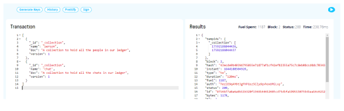

Fluree has a docker image will can be used to easily spin up a Fluree instance, below are the steps to achive this.  

1.  You need to have the docker desktop.  
2.  Run the following command in your command prompt   
        docker run -d --restart=always -p 8090:8090 fluree/ledger:latest  
3.  This will add a container in your fluree application in a running state.  
4.  Hover the mouse on the container, and use the option to Open in Browser    
5.  Now you can create a ledger to start with it, make sure to use only smaller letters in the ledger name.  
    

6.  Now you will need to create a schema which contains, collections and predicates which are tables and colmns in databse terms.  
7.  Below JSON files on the left side of the screenshot will create two collectioned named person and chat respectively.  
      
    Click on the run button on top left side of the screen to execute the transaction. 

8.  Now you will need to add fields to the tables, below JSON will create predicates within the collections.
      
  
9.  Now that you have created the fields you can push the data into the tables.
       

10. Now we will query the collection to fetch the data. 
          

You can explore the fluree doumentation for further learnings.   
    https://developers.flur.ee/docs/overview/fluree_basics/
