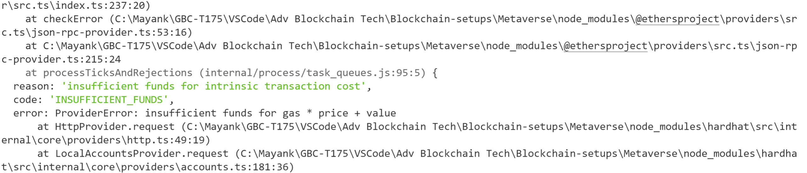
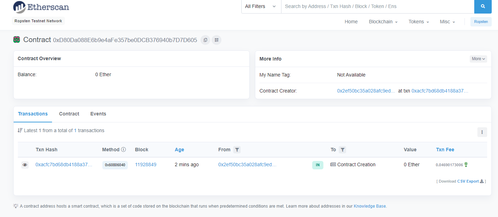
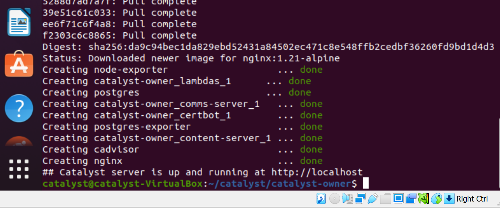

## Deploying Land Registry smart contract using hardhat, please follow below steps.

1.  Spin the hardhar project up using below commands  
	npm install --save-dev hardhat  
	npx hardhat  
	Install the listed dependencies  
	npm install openzeppelin-zos dotenv  
2.  Clone the contracts from the below github link https://github.com/decentraland/land/tree/master/contracts
3.  Make changes to the deploy.js in order to deploy your contracts.
4.  Create an .env file to store network details like URL and key.
5.  Update the hardhat.config file with network details
6.  npx hardhat compile
7.  Error Faced : max code size exceeded Solved: Update compiler file compilers  

            compilers: 
            [
            {
                version: "0.4.24",
                settings: {
                optimizer: {
                enabled: true,
                runs: 999999
                },
                evmVersion: "byzantium", 
                outputSelection: {
                "*": {
                    "": [
                    "ast"
                    ],
                    "*": [
                    "evm.bytecode.object",
                    "evm.deployedBytecode.object",
                    "abi",
                    "evm.bytecode.sourceMap",
                    "evm.deployedBytecode.sourceMap",
                    "metadata"
                    ]
                },
                }
            }
            ]

8.  npx hardhat run scripts/deploy.js --network ropsten

9.  Error Faced: Insufficent balance, selected the account with enough ethers. 
    
10. Contract is deployed.
    
11. Confirm by visitng the address on Etherscan.
    

## Installing Catalyst on Ubuntu 20.4 using virtual box

1.  Install Docker
    sudo apt-get update  
    sudo apt-get install apt-transport-https ca-certificates curl gnupg  
    curl -fsSL https://download.docker.com/linux/ubuntu/gpg | sudo gpg --dearmor -o /usr/share/keyrings/docker-archive-keyring.gpg  
    echo "deb [arch=amd64 signed-by=/usr/share/keyrings/docker-archive-keyring.gpg] https://download.docker.com/linux/ubuntu $(lsb_release -cs) stable" | sudo tee /etc/apt/sources.list.d/docker.list > /dev/null  
    sudo apt-get update  
    sudo apt-get install docker-ce docker-ce-cli containerd.io  
2.  Install Docker-Compose  
    sudo curl -L "https://github.com/docker/compose/releases/download/1.28.5/docker-compose-$(uname -s)-$(uname -m)" -o /usr/local/bin/docker-compose  
    sudo chmod +x /usr/local/bin/docker-compose  
3.  Add $USER to Docker Group  
    sudo groupadd docker  
    sudo usermod -aG docker $USER  
    newgrp docker  
4.  Verify Docker Install  
    docker run hello-world  
    docker-compose --version  
5.  Stop Apache2  
    sudo systemctl disable apache2 && sudo systemctl stop apache2  
6.  Install Git  
    sudo apt-get update  
    sudo apt-get install git  
7.  Create folder for source code  
    mkdir catalyst  
    cd catalyst  
8.  Clone Catalyst-owner from git hub  
    git clone https://github.com/decentraland/catalyst-owner  
9.  Delete env files  
    cd catalyst-owner  
    mv .env.example .env  
    mv .env-advanced.example .env-advanced  
10. Add email to the env file  
    $ nano .env  
    EMAIL=mayanksae@gmail.com  
    CONTENT_SERVER_STORAGE=./storage  
    CATALYST_URL=http://localhost  
11. Create folder for storage  
    mkdir storage  
12.  Run Catalyst  
    $ ./init.sh  
    

