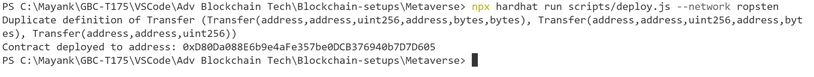

## Deploying Land Registry smart contract using hardhat, please follow below steps.

1.  Spin the hardhar project up using below commands  
	npm install --save-dev hardhat  
	npx hardhat  
	Install the listed dependencies  
	npm install openzeppelin-zos dotenv  
2.  Clone the contracts from the below github link https://github.com/decentraland/land/tree/master/contracts
3.  Make changes to the deploy.js in order to deploy your contracts.
4.  Create an .env file to store network details like URL and key.
5.  Update the hardhat.config file with network details
6.  npx hardhat compile
7.  Error Faced : max code size exceeded Solved: Update compiler file compilers  
            compilers: 
            [
            {
                version: "0.4.24",
                settings: {
                optimizer: {
                enabled: true,
                runs: 999999
                },
                evmVersion: "byzantium", 
                outputSelection: {
                "*": {
                    "": [
                    "ast"
                    ],
                    "*": [
                    "evm.bytecode.object",
                    "evm.deployedBytecode.object",
                    "abi",
                    "evm.bytecode.sourceMap",
                    "evm.deployedBytecode.sourceMap",
                    "metadata"
                    ]
                },
                }
            }
            ]

8.  npx hardhat run scripts/deploy.js --network ropsten

9.  Error Faced: Insufficent balance, selected the account with enough ethers. 
    
10. Contract is deployed.
    
11. Confirm by visitng the address on Etherscan.
    
